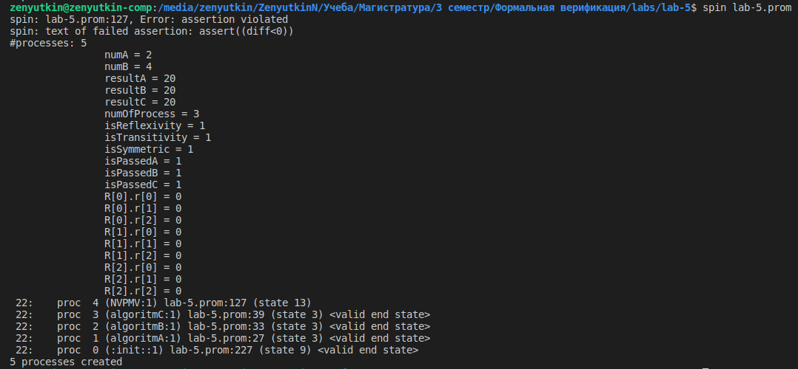

## Лабораторная работа 5

Проверяются три алгоритма нахождения суммы квадратов двух чисел. Все алгоритмы запускаются, ни один не заканчивается с ошибкой.

В качестве алгоритма голосования был выбран алгоритм голосования абсолютным большинством голосов (NVP-MV).

При голосовании абсолютным большинством все выходы делятся на классы. Для принятия решения необходимо, чтобы хотя бы

версии имели идентичные результаты (где  - это оператор округления до ближайшего большего целого числа). Считается, что выходные данные большинства (т. е. класса с количеством элементов, равным или превышающим m) мультиверсий верны, а остальные - ошибочными. Если равные выходы меньше m, то такая ситуация интерпретируется как неопределенность и, следовательно, невозможно принять решение.

### Результат верификации

